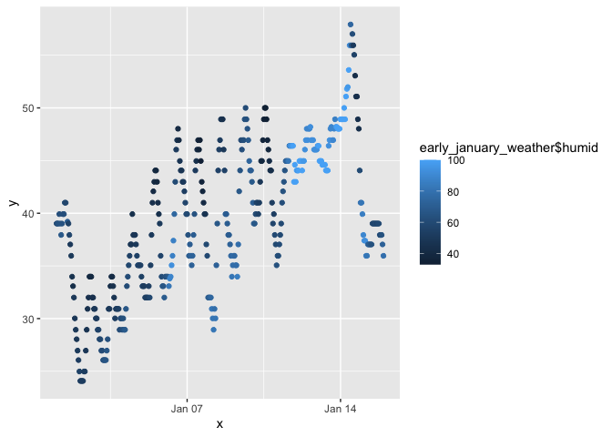

p8105_dmh2228_hw1
================
Diana Hernandez
2023-09-19

## Problem 1 and 2: load tidyverse

``` r
library(tidyverse)
```

    ## ── Attaching core tidyverse packages ──────────────────────── tidyverse 2.0.0 ──
    ## ✔ dplyr     1.1.3     ✔ readr     2.1.4
    ## ✔ forcats   1.0.0     ✔ stringr   1.5.0
    ## ✔ ggplot2   3.4.3     ✔ tibble    3.2.1
    ## ✔ lubridate 1.9.2     ✔ tidyr     1.3.0
    ## ✔ purrr     1.0.2     
    ## ── Conflicts ────────────────────────────────────────── tidyverse_conflicts() ──
    ## ✖ dplyr::filter() masks stats::filter()
    ## ✖ dplyr::lag()    masks stats::lag()
    ## ℹ Use the conflicted package (<http://conflicted.r-lib.org/>) to force all conflicts to become errors

## Problem 1: load moderndive

``` r
library(moderndive)
```

## Problem 1: load “early_january_weather”

``` r
data("early_january_weather")
```

## Problem 1: descriptive information of “early_january_weather”

``` r
view(early_january_weather)

head(early_january_weather)

tail(early_january_weather)
```

“early_january_weather” has 358 observations and 15 variables (origin,
year, month, day, hour, temp, dewp, humid, wind_dir, wind_speed, precip,
pressure, visib, time_hour).

## Problem 1: rows and columnns of “early_january_weather”

``` r
nrow(early_january_weather)
```

    ## [1] 358

``` r
ncol(early_january_weather)
```

    ## [1] 15

“early_january_weather” has 358 rows and 15 columns.

## Problem 1: mean temperature in “early_january_weather”

``` r
mean(early_january_weather$temp)
```

    ## [1] 39.58212

The mean temperature in “early_january_weather” is 39.58212.

## Problem 1: scatter plot of temp and time_hour in “early_january_weather”

``` r
plot_df = tibble(
  x = early_january_weather$time_hour,
  y = early_january_weather$temp
)

ggplot(plot_df, aes(x = x, y = y, color = early_january_weather$humid)) + geom_point()
```

<!-- -->

``` r
ggsave("early_january_weather_plot.pdf", height = 5, width = 5)
```

The scatter plot shows fluctuations between temperature and hour.
Humidity varies by day.

## Problem 2: data frame

``` r
random_sample_df = tibble(
  norm_samp = rnorm(10),
  vec_logical = norm_samp > 0,
  vec_char = c("This", "is", "an", "example", "of", "using", "data", "frames", "and", "vectors"),
  vec_factor = factor(c("low", "medium", "high", "high", "high", "low", "medium", "low", "high", "low")),
  vec_levels = factor(vec_factor, levels = c("low", "medium", "high"))
)
```
